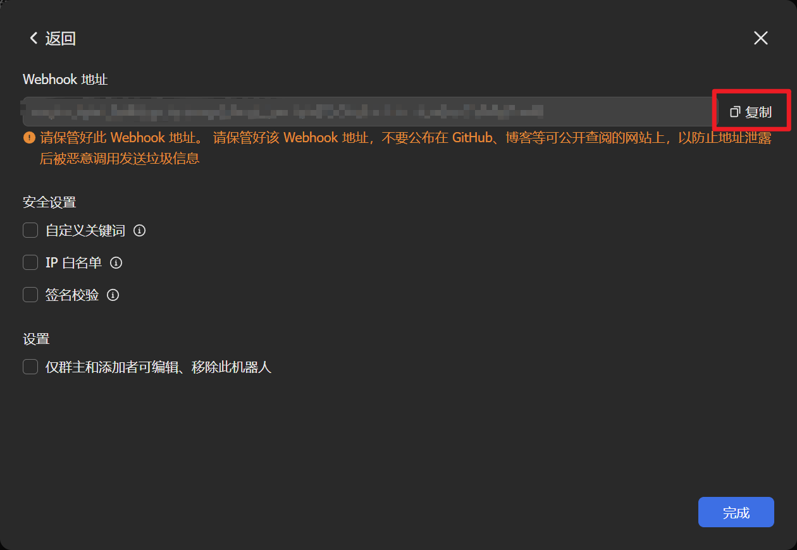
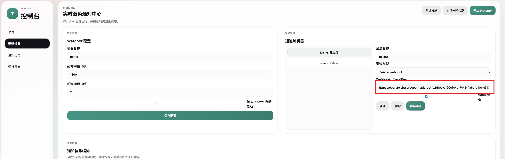
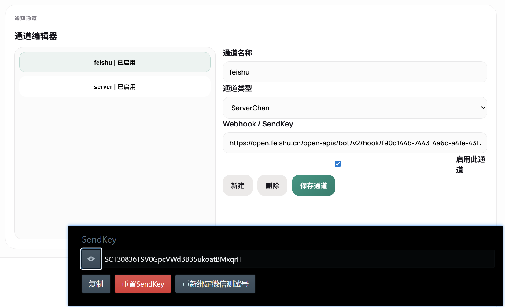

# Tongzhi Render Notifier
**_快速使用可以直接跳转到下文[快速开始](#快速开始)_**

一个面向 `Cinema 4D` 的渲染通知工具。

它由两部分组成：

- `c4d_render_notifier/`
  - 安装到 `C4D` 的插件
  - 负责检测渲染状态并写入运行信息
- `watcher/`
  - 独立后台 watcher
  - 负责托盘常驻、读取状态、发送通知、提供 Web 控制台

适合解决这类问题：

- `C4D` 渲染完成后没有提醒
- 多台机器渲染时，不容易区分是哪台机器完成
- 希望把渲染完成或超时提醒推送到飞书、Server酱等渠道

## 当前版本

- 版本：`v1.0.0`
- 发布日期：`2026-04-24`

发布说明见：

- [RELEASE_NOTES.md](RELEASE_NOTES.md)
- [CHANGELOG.md](CHANGELOG.md)

## 主要功能

- `C4D` 手动渲染完成通知
- `C4D` 渲染队列完成通知
- 超时提醒
- 飞书 `Webhook`
- `Server酱`
- 通用 `Webhook`
- 托盘常驻
- 开机自启
- 静默启动，无黑框
- 浏览器 Web 控制台
- 中文界面
- 通知模板配置
  - 渲染完成
  - 超时提醒
  - 测试消息
- 通知字段编排
  - 状态
  - 机器
  - 工程
  - 时间
  - 渲染模式
  - 输出路径
  - 开始时间

## 推荐使用方式

当前推荐只使用这一套正式入口：

1. 把 `c4d_render_notifier/` 整个目录复制到：
   `Cinema 4D/plugins/`
2. 运行 `TongzhiWatcher.exe`
3. 浏览器打开控制台后，完成机器名称、通知通道和通知模板配置
4. 先执行一次测试发送，再进行真实渲染验证

## 快速开始

### 1. 安装 C4D 插件

把：

- `c4d_render_notifier`

复制到自己的插件目录：

- 比如我的就是 `C:\Program Files\Maxon Cinema 4D 2025\plugins\`
- 当前测试版本是 `2025.3.1`，可以正常运行

插件入口文件是：

- `c4d_render_notifier/c4d_render_notifier.pyp`

### 2. 启动 watcher

开发环境可运行：

- `watcher/launch_web_console.bat`

发布版可直接运行：

- `watcher/TongzhiWatcher.exe`

启动后它会：

- 静默运行后台 watcher
- 启动托盘图标
- 自动打开浏览器控制台

### 3. 配置通知

#### 3.1 关于通知

- 飞书 webhook（推荐指数：⭐⭐⭐⭐⭐）

  配置界面：

  点击创建群组 -> 点击群设置 -> 添加群机器人 -> 添加机器人 -> 自定义机器人 -> 点击添加，这时候就会有链接出现。

  

  这里选择 `feishu webhook`，直接复制链接到配置界面，保存设置就可以了。

  

- Server酱

  - 免费版有一些限制，喜欢微信通知可以用这个配置，需要轻微折腾
  - 官网：[https://sct.ftqq.com/](https://sct.ftqq.com/)
  - 推荐指数：⭐⭐⭐

  同样只需要复制 API Key 就可以收到通知。

  

在浏览器控制台中配置：

- 机器名称
- 超时阈值
- 通知通道
- 开机启动
- 通知模板
- 通知字段顺序和内容

## 配置文件位置

程序默认读取：

`%APPDATA%\TongzhiRenderNotifier\`

主要文件：

- `tongzhi_render_notifier.json`
  - 主配置文件
- `runtime_state.json`
  - 插件写入的实时渲染状态
- `plugin.log`
  - 插件日志
- `watcher.log`
  - watcher 日志
- `notify_history.json`
  - 通知历史

如果要迁移到另一台电脑，请重点复制：

`%APPDATA%\TongzhiRenderNotifier\tongzhi_render_notifier.json`

## 一点感受

AI 时代最笨的是人。一个下午慢悠悠就写好了功能，又一个半天套了一个好看的 Web UI，满足了自己码农的小心愿。
